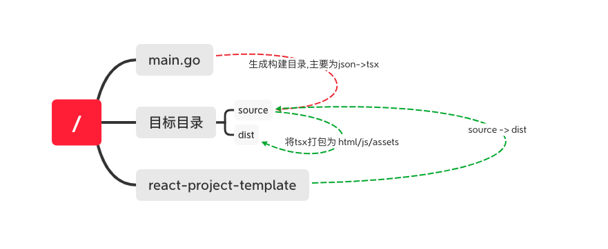

>##  此库可用来将gitbook线上导出的数据转换成SPA Web

# 如何使用？

### 1. `cd ./react-project-template && yarn && ../` 到前端的构建目录初始化依赖模块  

### 2. `make exec/parser` 编译golang的可执行文件，它将用来解析zip中的json，至tsx语法  

### 3. `make build ZIP=压缩包路径 DIR=目标路径 WHITE=可选版本白名单,最后将只生成此白名单下的版本 DEFAULT=默认版本` 构建SPA Web  

Ps: Makefile 项目根目录下执行

# 如何工作的？
此项目主要分为两部分,`根目录`下的Golang部分与`react-project-template`目录下的JavaScript部分  

├── README.md  
├── go.mod  
├── go.sum  
├── makefile  
├── formatter.go `格式化tsx文件的入口`  
├── fs.go  `io操作封装的一些基本方法`  
├── h.go  `生成Element tag的函数`  
├── main.go  `入口文件 生成了基本的构建目录`  
├── node.go  `json->react dom`  
├── unzip.go  `解压zip`  
├── static  `静态资源目录,替换相应文件可更换生成的SPA，tab icon与web logo`  
├── template.go  `生成tsx字符串的模版文件`  
├── render.go  `根据Element tag的type渲染相应的tsx 字符串`  
├── react-project-template  `前端编译目录`   
    └── yarn.lock  
    ├── package.json  
    ├── tsconfig.json  
    ├── webpack.dev.config.js  
    ├── webpack.prod.config.js  
    ├── lib  `基本函数`  
        ├── CreateMathComponent.tsx  `渲染公式的组件`  
        ├── OnHover.tsx  `hover状态的wrapper组件`  
        ├── checkType.ts  `匹配Element tag的类型`  
        ├── findChildType.ts  `根据type递归寻找符合规则的第一项数据`  
        ├── findPage.ts  `用来寻找revision.json中的page数据`  
        ├── mergeClassName.ts  `合并ClassName`  
        └── renderFileSize.ts  `渲染文件大小`  
    ├── parts  `渲染元素的基本库,包含了各类型type的渲染组件`  
    ├── server.js  `可用此来运行一个打包好的项目,而无须重跑yarn dev`  
    ├── styles  `样式目录`  
    ├── types  `类型声明文件`  

go主要将导出的Json做了语法与文档的结构分析，编译成了tsx文件，并相应的打包了一些依赖(图片/路由文件/文件映射关系的json...)到构建目录。      

js主要将构建目录中的tsx，通过webpack打包至命令行指定的位置。  

最终的目标产物为标准的 html/bundle.js/asssets dir

